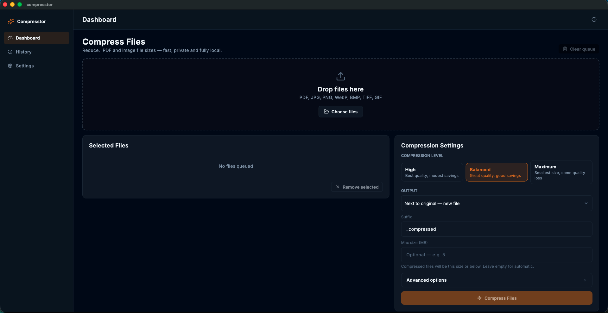
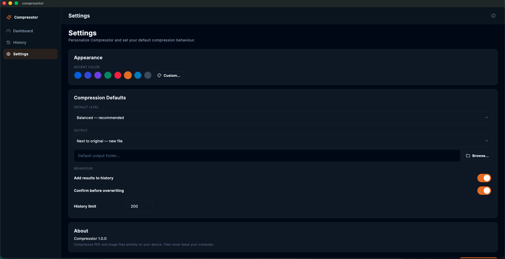

# Compresstor

**Compress PDF and image files — fast, private and fully local.**

Compresstor is a premium desktop app (Flutter frontend + Python compression
engine) that shrinks PDF and image files without uploading them anywhere. Its
interface follows the visual language of Filament, shadcn/ui and Tailwind CSS:
clean cards, a collapsible sidebar, dark mode, toast notifications and subtle
animations. The engine (PyMuPDF + Pillow) runs as a bundled sidecar process.

 

## Screenshots





## Features

- **PDF compression** — re-encodes embedded images (JPEG quality + DPI
  scaling), garbage-collects dead objects, deflates streams, strips metadata.
  Typical savings: 60–95%.
- **Image compression** — JPEG/WebP quality control, PNG palette
  quantization, resizing, metadata stripping, BMP→PNG and format conversion.
- **Presets** — High / Balanced / Maximum, plus an advanced panel with
  sliders for PDF quality, max DPI, image quality and max dimension.
- **Max size target** — set a size in MB and the output is compressed to
  that size or below (iterative quality/resolution ladder; errors when the
  target is not smaller than the original file).
- **Output modes** — new file next to the original, chosen folder, or
  replace in place (with confirmation).
- **Filament-style table** — sorting, search, filtering, pagination,
  multi-select, right-click context menu, status badges.
- **History** — every job is stored locally with savings statistics.
- **Theming** — dark-only interface, 8 accent colors or a custom picker,
  Inter typography, 8px spacing system.
- **Fully offline** — your files never leave the device.

## Requirements

- Python 3.11 (3.9+ works for dev)
- macOS 12 or newer, Windows 10 21H2+ (build/run)
- Runtime binary for macOS 12+ / Windows 10+ (see release/)

## Development

The app is a Flutter desktop frontend (`flutter/`) talking JSON-lines over
stdin/stdout to the Python engine (`app/engine/engine_cli.py`, per
`docs/engine-protocol.md`). In development the engine runs from the repo venv:

```bash
python3.11 -m venv .venv
.venv/bin/pip install -r requirements.txt
.venv/bin/pip install pyinstaller        # only needed for release builds

cd flutter && flutter pub get && flutter run          # app + engine (dev)
cd flutter && flutter test                             # 67 Dart tests (incl. goldens)
cd flutter && flutter test test/visual_qa_test.dart --update-goldens
#                                                       regenerate test/goldens/*.png
.venv/bin/python -m pytest tests/                     # 38 engine tests
cd flutter && flutter test integration_test/compression_flow_test.dart -d macos
#                                                       real engine through the UI
```

## Architecture

Two layers, one protocol (`docs/engine-protocol.md`):

```
flutter/                     Flutter UI: shell, pages, theme, state
   lib/engine/               EngineClient (spawns engine_cli, parses JSON-lines)
app/engine/engine_cli.py     engine entry point — one subcommand per process
app/core/                    entities, ports (interfaces), use cases — no Qt
app/adapters/                compressors (PyMuPDF, Pillow) + JSON stores
scripts/                     build scripts + QA harness (parity, engine QA)
packaging/                   PyInstaller spec (engine sidecar only)
release/                     built artifacts (macOS / Windows)
```

Dependency rule: `adapters -> core`; the core layer is framework-free and
fully unit-tested. The Flutter side stays thin — all compression logic lives
in the Python engine, so old/new app outputs are byte-for-byte identical for
deterministic formats (`scripts/parity_check.py`).

## Building releases

Two-stage: the engine sidecar is built with PyInstaller (no Qt), then the
Flutter app is built and the sidecar is bundled into the app's Resources
(`Contents/Resources/engine/` on macOS; `engine\` next to the exe on Windows).
`EngineClient` auto-detects the bundled engine at runtime and falls back to
the dev venv in development.

### Building from a fresh machine

Both build scripts bootstrap everything themselves — clone the repo and run
the build; no venv setup, no manual pip. Prerequisites on the machine:

| Tool | macOS | Windows |
| --- | --- | --- |
| Flutter SDK (stable) + `flutter` on PATH | yes | yes |
| Xcode + CocoaPods (macOS desktop target) | yes | — |
| Visual Studio 2022 "Desktop development with C++" (Windows target) | — | yes |
| Python 3.10+ (`python3`/`python`) | yes | yes |
| `gh` CLI (publishing only) | optional | optional |

```bash
# macOS (any Mac): creates .venv, installs deps, builds engine + app + zip
./scripts/build_macos.sh            # add --dmg for the installer

# Windows 10/11: identical — creates .venv, builds everything
scripts\build_windows.bat
```

Each build emits the auto-update artifacts the in-app updater consumes
(Settings → About → Check for updates):

```
release/Compresstor-<version>-macos.zip     # the .app zipped (ditto)
release/Compresstor-<version>-windows.zip   # the release folder zipped
release/Compresstor-<version>.sha256        # "sha256  <asset>" lines, one per zip
```

CI is available too: pushing a `v*` tag (or `workflow_dispatch`) runs
`.github/workflows/build-{macos,windows}.yml` on GitHub's runners using the
same scripts, and uploads the zips + checksum as Actions artifacts.

### Releasing a new version

1. **Bump the version** — edit `version.json` at the repo root (the only
   place): `{ "name": "compresstor", "version": "1.0.1", "build": 2 }`.
   Build scripts pass it to `flutter build` (Info.plist / Windows product
   version) and bundle it so the About card reads it at runtime.
2. **Build** on macOS (`./scripts/build_macos.sh`) and Windows
   (`scripts\build_windows.bat`) — each produces its zip + the sha256 lines.
3. **Publish** (one command, needs `gh` CLI):
   `./scripts/publish_release.sh` — creates GitHub release `v<ver>`, uploads
   the zips + checksum, marks it latest. Release notes come from
   `RELEASE_NOTES.md` if present (first line shows in the About card).
4. Users click **Check for updates** → **Update** to auto-download, verify
   (SHA-256) and replace the app on macOS and Windows.

Architecture notes:
- The Flutter `.app` is a universal2 binary (Xcode builds both archs), but the
  engine sidecar is built for the HOST arch by default (arm64 here). A
  universal2 engine needs a lipo-merged universal venv — see
  `scripts/merge_universal_venv.sh` and `docs/stack-migration-plan-flutter.md`.
- The app is NOT sandboxed (the sidecar needs unrestricted file access; v1.0.0
  shipped the same way) and is ad-hoc signed, so first launch requires
  right-click → Open (or System Settings → Privacy & Security → Open Anyway).

## License

MIT
